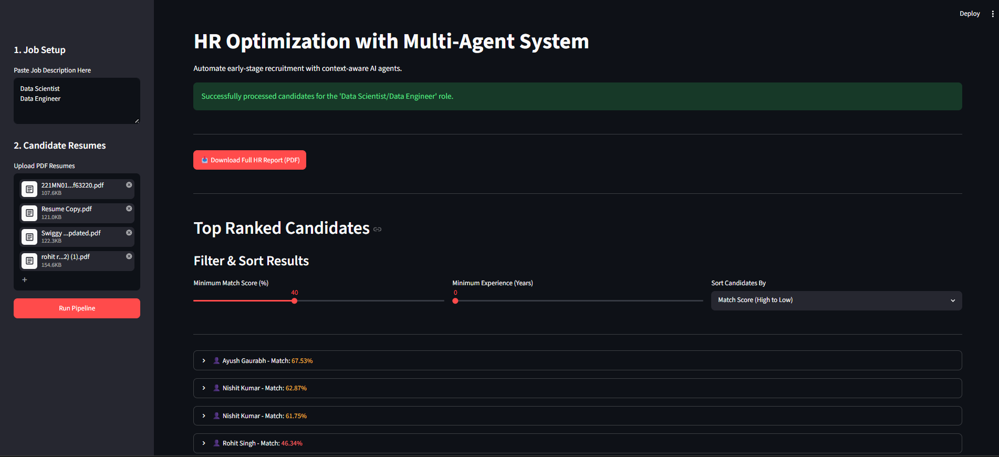
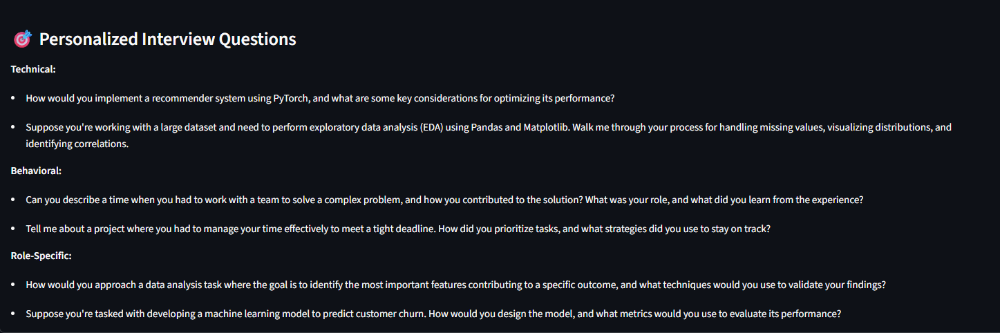
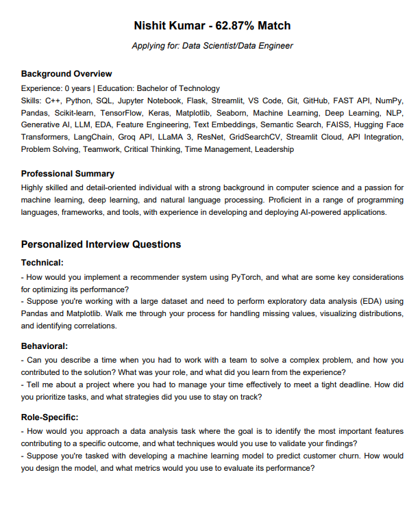

# 🤖 HireMind: Multi-Agent Recruitment System

> An AI-powered recruitment platform that automates candidate screening, semantic matching, interview generation, and HR reporting using Large Language Models, Vector Embeddings, LangGraph, and Streamlit.


## 🚀 Overview

HireMind is an end-to-end AI recruitment automation system designed to streamline the hiring process through intelligent candidate evaluation and multi-agent orchestration.

The platform accepts a Job Description (JD) and multiple candidate resumes, then utilizes specialized AI agents to analyze, rank, and generate personalized interview questions for each applicant. By combining semantic search, vector embeddings, and LLM-powered reasoning, the system goes beyond traditional keyword matching to identify the most suitable candidates.

---

## 📸 Application Screenshots

### 🏠 Main Dashboard
Displays job description input, resume upload interface, and pipeline controls.


(screenshots/dashboard1.png)

---

### 📊 Candidate Ranking & Filtering
Interactive candidate ranking with score-based filtering, sorting, and profile exploration.


---

### 🎯 Personalized Interview Question Generation
AI-generated technical and behavioral interview questions tailored to each candidate.



---

### 📄 Automated PDF Report Export
One-click generation of detailed HR reports containing candidate evaluations and interview recommendations.



---

## ✨ Key Features

### 🧠 Multi-Agent Recruitment Pipeline

The system orchestrates four specialized AI agents:

* **JD Parser Agent** – Extracts structured hiring requirements from raw job descriptions.
* **Resume Screener Agent** – Parses resumes and generates standardized candidate profiles.
* **Candidate Matcher Agent** – Performs semantic similarity matching between candidates and job requirements.
* **Interview Generator Agent** – Creates personalized technical and behavioral interview questions.

### 🔍 Semantic Candidate Matching

* Uses SentenceTransformers (`all-MiniLM-L6-v2`)
* Context-aware skill matching
* Cosine similarity-based candidate ranking
* Reduces false negatives caused by keyword-only screening

### 🗄️ Persistent Talent Memory

* ChromaDB vector database integration
* Stores screened candidate profiles
* Enables future candidate retrieval and talent pooling

### 📄 Automated HR Report Generation

* Generates downloadable PDF reports
* Includes candidate summaries, scores, strengths, and interview questions
* One-click export for HR teams

### 📊 Interactive Dashboard

Built using Streamlit with:

* Dynamic candidate filtering
* Candidate ranking and sorting
* Expandable profile cards
* Session state management
* Real-time score visualization

---

## 🏗️ System Architecture

```text
Job Description + Candidate Resumes
                │
                ▼
        PDF Text Extraction
                │
                ▼
        JD Parser Agent
                │
                ▼
     Resume Screener Agent
                │
                ▼
     Candidate Matcher Agent
                │
                ▼
    Interview Generator Agent
                │
                ▼
      ChromaDB Vector Memory
                │
                ▼
      Streamlit Dashboard
                │
                ▼
       PDF Report Generation
```

## 🛠️ Tech Stack

| Category             | Technologies                       |
| -------------------- | ---------------------------------- |
| Programming Language | Python 3.10+                       |
| Agent Orchestration  | LangGraph, LangChain               |
| LLM Providers        | Google Gemini, Groq                |
| Embeddings           | SentenceTransformers               |
| Vector Database      | ChromaDB                           |
| Data Processing      | PDFPlumber, Pydantic, Scikit-Learn |
| Frontend             | Streamlit                          |
| Reporting            | FPDF                               |
| Monitoring           | Logging, Custom Exception Handling |


## 📂 Project Structure

```text
📦 HR-Multi-Agent-System
│
├── 📂 artifacts/
│   └── 📂 hr_memory/                 # ChromaDB persistent vector storage
│
├── 📂 logs/                          # Application and error logs
│
├── 📂 src/
│   │
│   ├── 📂 agents/                    # Specialized AI agents
│   │   ├── 📜 jd_parser.py
│   │   ├── 📜 resume_screener.py
│   │   ├── 📜 candidate_matcher.py
│   │   └── 📜 interview_generator.py
│   │
│   ├── 📂 memory/                    # Vector database operations
│   │   └── 📜 chroma_store.py
│   │
│   ├── 📂 pipeline/                  # LangGraph orchestration workflow
│   │   ├── 📜 orchestrator.py
│   │   └── 📜 state.py
│   │
│   ├── 📂 schemas/                   # Pydantic data models
│   │   ├── 📜 candidate_schema.py
│   │   └── 📜 jd_schema.py
│   │
│   ├── 📂 utils/                     # Utility functions
│   │   ├── 📜 exception.py
│   │   ├── 📜 logger.py
│   │   ├── 📜 pdf_generator.py
│   │   └── 📜 pdf_reader.py
│   │
│   └── 📜 config.py                  # LLM provider & application configuration
│
├── 📂 ui/
│   │
│   ├── 📂 components/
│   │   └── 📜 candidate_card.py
│   │
│   └── 📜 app.py                     # Streamlit dashboard entry point
│
├── 📜 setup.py                       # Project packaging configuration
├── 📜 requirements.txt               # Project dependencies
├── 📜 .env                           # API keys (ignored by Git)
├── 📜 .gitignore
├── 📜 README.md
└── 📜 LICENSE
```


## ⚙️ Installation

### Clone Repository

```bash
git clone https://github.com/YourUsername/HR-Multi-Agent-System.git
cd HR-Multi-Agent-System
```

### Create Virtual Environment

#### Windows

```bash
python -m venv venv
venv\Scripts\activate
```

#### Linux / macOS

```bash
python3 -m venv venv
source venv/bin/activate
```

### Install Dependencies

```bash
pip install -r requirements.txt
```

### Configure Environment Variables

Create a `.env` file in the project root:

```env
GEMINI_API_KEY=your_gemini_api_key
GROQ_API_KEY=your_groq_api_key
```

### Run Application

```bash
streamlit run ui/app.py
```

## 📈 Future Enhancements

* Email automation for candidate communication
* OCR support for scanned resumes
* Docker containerization
* AWS/GCP deployment
* GitHub profile analysis
* Multi-modal candidate evaluation

## 🤝 Contributing

Contributions are welcome. Feel free to open issues, suggest improvements, or submit pull requests.

## 📜 License

This project is licensed under the MIT License.

## 👨‍💻 Author

**Nishit Kumar**

